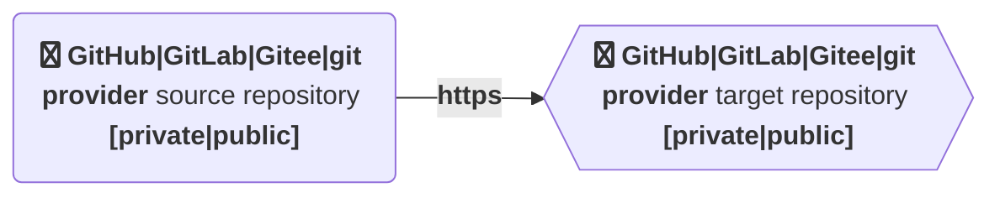

# Repos Mirror Action
[](https://github.com/kubeservice-stack/repos-mirror-action/actions/workflows/repos-mirror.yml)

Auto mirror repos by GitHub Action

## Features



* Sync other public or private repository (e.g. template repositories) with the current repository
* different git provider like GitLab, Gittea,.. as source are supported (with https).
* It is not necesarly needed that source and target repository have same base history.
  Because of that reason it is possible to merge 2 total different repositories with the help of the action.

## Usage

### Template Repository
```yaml
name: <action-name>

on: 
  - push
  - delete

jobs:
  sync:
    runs-on: ubuntu-latest
    name: Repo Mirror Sync
    steps:
    - uses: actions/checkout@v3
    - name: Repo Mirror Sync
      uses: kubeservice-stack/repos-mirror-action@<latest version>
      with:
        # Such as https://github.com/dongjiang1989/mirror-action.git
        target-url: <target-url>
        # Such as dongjiang1989
        target-username: <target-username>
        # You can store token in your project's 'Setting > Secrets' and reference the name here. Such as ${{ secrets.ACCESS_TOKEN }}
        target-token: <target-token>
```

### Configuration parameters

| Variable | Description | Required | `[Default]` |
|----|----|----|----|
| target-token | Token for the repo. Can be passed in using `${{ secrets.ACCESS_TOKEN }}` | `true` |  |
| target-username | Repository user name | `true` | |
| target-url | The target Url with `https` protocol | `true` |  |

* `target-token` the API token to create non-existent repo, You can get Github token in [here](https://github.com/settings/tokens), and the Gitee in [here](https://gitee.com/profile/personal_access_tokens).
